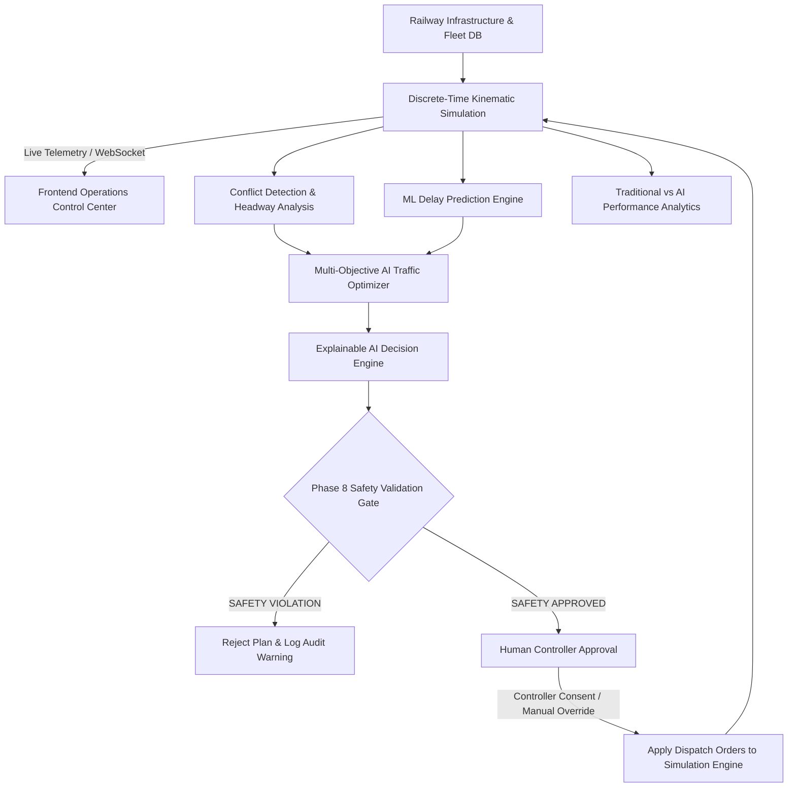

# System Architecture

**Project**: Maximizing Section Throughput Using AI-Powered Precise Train Traffic Control  
**Classification**: Academic Simulation, Algorithmic Modeling & Decision-Support Prototype  

---

## 1. High-Level Architecture Overview

The system is engineered around a reactive, closed-loop simulation and decision-support pipeline. The discrete simulation engine generates live telemetry, which feeds into conflict detection and machine learning delay forecasting. When congestion or conflicts are identified, the multi-objective AI optimizer formulates a precedence-ordered schedule. Every recommendation must pass through the **Phase 8 Formal Safety Validator** before being presented to the human controller or applied to the simulation.

---

## 2. Core Subsystems & Components

### 2.1. Frontend Operations Control Center (`frontend/`)
- **Technology**: React 18, Vite 5.4, Lucide React, Axios, Native WebSockets.
- **Role**: Provides the user interface for traffic controllers, displaying:
  - Synoptic SVG Railway Network Map with dynamic train coordinates and directional track occupancy colors (`FREE`, `OCCUPIED`, `CONGESTED`, `BLOCKED`, `EMERGENCY`).
  - AI Decision Hero Banner with confidence metrics, mathematical score breakdowns, and 9-rule formal safety verification status.
  - Emergency Incident Console for injecting synthetic disruptions and triggering AI recovery plans.
  - Manual Controller Override Panel with immediate safety validation feedback.
  - 12-Step Autonomous Demonstration Stepper.

### 2.2. FastAPI REST & WebSocket Backend (`backend/app/`)
- **Technology**: FastAPI 0.110+, Uvicorn, Pydantic v2, Pydantic-Settings.
- **Role**: Coordinates asynchronous routing, input validation, centralized error handling, and structured logging.
- **Route Modules**:
  - `system.py`: Service health (`/api/health`), uptime, and cataloging.
  - `railway.py`: CRUD for stations, sections, tracks, trains, schedules.
  - `simulation.py`: Clock stepping, start, pause, reset, WebSocket stream.
  - `conflicts.py`: Real-time headway scans and conflict matrices.
  - `ml.py`: Delay predictions and model version metadata (`/api/ml/model-info`).
  - `optimization.py`: Throughput optimization and candidate sequences.
  - `safety.py`: 9-rule validation audits and emergency stop triggers.
  - `analytics.py`: Benchmark experiments and multi-run comparative metrics.
  - `explainability.py`: Feature attribution, confidence calibration, controller feedback.
  - `control_center.py`: Scenario lifecycle, manual overrides, emergencies, demo sessions.

### 2.3. Kinematic Simulation Engine (`simulation/`)
- **Kinematics Model**: Discrete-time kinematic simulation updating train acceleration, cruising speed, and braking:
  $$v(t + \Delta t) = \min\left(v_{\max}, v(t) + a \cdot \Delta t\right)$$
  $$x(t + \Delta t) = x(t) + v(t) \cdot \Delta t + \frac{1}{2} a (\Delta t)^2$$
- **Block Tracking**: Maintains reservation locks on tracks, section entries, platforms, and dwell timers.

### 2.4. Conflict Detection & Headway Monitoring (`conflict_detection/`)
- **Headway Protection**: Enforces safe spatial and temporal intervals between trains:
  - Minimum statutory spatial headway: $1.5\text{ km}$
  - Minimum statutory temporal headway: $120\text{ seconds}$
- **Conflict Types**:
  - **Opposing Conflict**: Two trains reserved on single/bidirectional track in reverse directions.
  - **Catch-up Conflict**: Faster train closing gap on slower leading train within braking distance.
  - **Junction Contention**: Multiple trains arriving at switch throat within simultaneous windows.

### 2.5. Machine Learning Delay Prediction Engine (`ml/`)
- **Algorithm**: `HistGradientBoostingRegressor` trained on 6,500 synthetic operating records across 15 operational features.
- **Accuracy Benchmarks**: $R^2 = 0.9782$, $\text{MAE} = 0.851\text{ min}$, $\text{RMSE} = 1.118\text{ min}$.
- **Inference Service**: Thread-safe in-memory model cached via `joblib`.

### 2.6. Multi-Objective AI Traffic Optimizer (`optimization/`)
- **Objective Function**:
  $$\max Z = w_1 \cdot \text{Throughput} - w_2 \cdot \text{TotalDelay} - w_3 \cdot \text{WaitTime} - w_4 \cdot \text{Congestion} + w_5 \cdot \text{PriorityWeight}$$
- Generates 4 ranked candidate dispatching sequences (AI Optimal, Priority Order, First-Come-First-Served, Conservative Hold).

### 2.7. Phase 8 Safety Validation Engine (`safety/`)
- **Infallible Gate**: Every dispatch action (AI recommendation, manual override, or emergency plan) must pass 9 formal railway safety rules:
  1. `R01`: Civil Track Speed Compliance ($v \le v_{\text{track\_limit}}$)
  2. `R02`: Minimum Separation Distance ($d \ge d_{\text{min\_headway}}$)
  3. `R03`: Minimum Temporal Headway ($\Delta t \ge 120\text{ s}$)
  4. `R04`: Safe Braking Distance Margin ($d_{\text{avail}} \ge \frac{v^2}{2b} \cdot 1.25$)
  5. `R05`: Opposing Movement Interlock
  6. `R06`: Platform Dwell Time Safety
  7. `R07`: Route Reservation Clearance
  8. `R08`: Maximum Section Capacity Constraint
  9. `R09`: Emergency Brake Buffer Margin
- **Invariant**: **Unsafe plans applied = 0**. Any plan failing a single rule is rejected.

### 2.8. Explainable AI Engine (`backend/explainability/`)
- **Feature Attribution**: Quantifies relative percentage importance of delay, priority, headway, and section utilization.
- **Calibrated Confidence**: Computes confidence level (`HIGH`, `MEDIUM`, `LOW`) derived from solver convergence, safety margin, and candidate separation.
- **Deterministic Explanations**: Produces plain-English justifications and comparative trade-off summaries without external cloud LLM dependencies.

### 2.9. Control Center & Scenario Management (`backend/control_center/`)
- **Circular Event Hub**: 500-event circular in-memory buffer with background SQLite persistence.
- **Manual Overrides**: Safety-interlocked manual commands (`HOLD_TRAIN`, `RELEASE_TRAIN`, `SPEED_ADVISORY`, `FORCE_ROUTE`).
- **Emergency Manager**: Disruption injection, automatic impact isolation, and AI recovery planning with headway staggering.

### 2.10. Database Persistence Layer (`backend/app/database/`)
- **Engine**: SQLite 3 with SQLAlchemy 2.0 ORM.
- **Threading**: Multi-threaded concurrency via `check_same_thread=False` and connection pooling.

